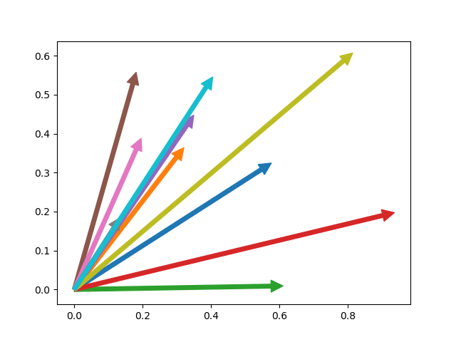

[](https://github.com/mpl-extensions/mpl-arrow/raw/main/LICENSE)
[](https://pypi.org/project/mpl-arrow)
[](https://python.org)
[](https://github.com/mpl-extensions/mpl-arrow/actions/workflows/ci.yml)
[](https://codecov.io/gh/mpl-extensions/mpl-arrow)

# mpl-arrow
A simpler way to draw nice arrows in matplotlib

## Installation
`pip install mpl-arrow`

## Example usage:
```python
from matplotlib import pyplot as plt
import numpy as np
from easy_arrow import arrow

ax = plt.gca()
for x,y in np.random.random((10, 2)):
        arrow(ax, x, y)
plt.show()
```


