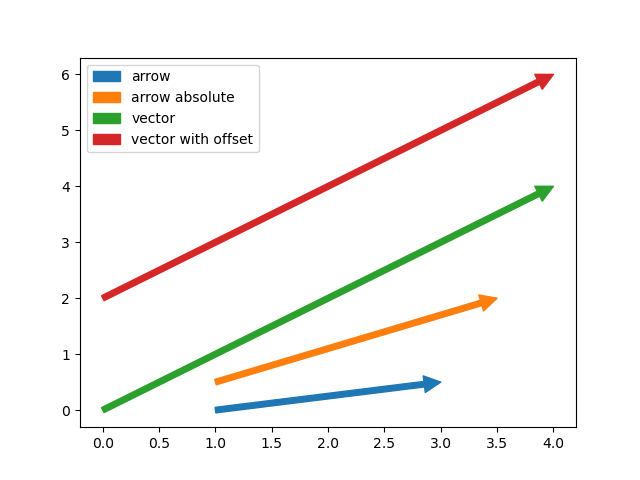

[](https://github.com/mpl-extensions/mpl-arrow/raw/main/LICENSE)
[](https://pypi.org/project/mpl-arrow)
[](https://python.org)
[](https://github.com/mpl-extensions/mpl-arrow/actions/workflows/ci.yml)
[](https://codecov.io/gh/mpl-extensions/mpl-arrow)
[](https://mpl-arrow.readthedocs.io/en/stable/)

# mpl-arrow
A simpler way to draw nice arrows in matplotlib

## Installation
`pip install mpl-arrow`

## Example usage:
```python
import matplotlib.pyplot as plt

from mpl_arrow import arrow, arrow_absolute, vector

fig, ax = plt.subplots()

#     x, y, dx, dy
arrow(1, 0, 2, 0.5, label="arrow")

#              x,  y,  x2,  y2
arrow_absolute(1, 0.5, 3.5, 2, label="arrow absolute")

#     dx, dy
vector(4, 4, label="vector")

#     dx, dy, x,    y
vector(4, 4, x=0, y=2, label="vector with offset")

plt.legend()
plt.show()
```


